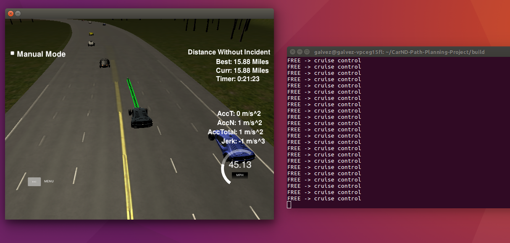
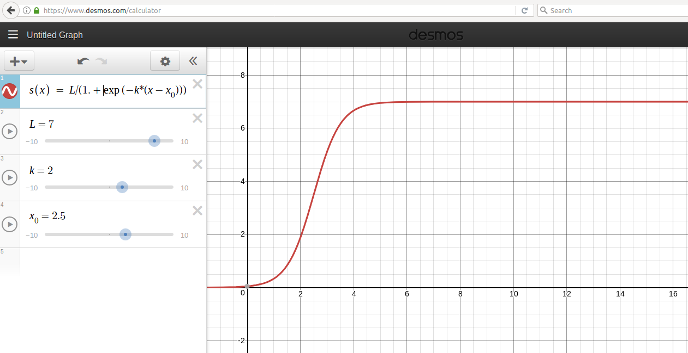

# CarND-Path-Planning-Project

Here is a reflection on how I did it to generate paths in this project.

## The car is able to drive at least 4.32 miles without incident.

The top right screen of the simulator shows the current/best miles driven without incident. Incidents include exceeding acceleration/jerk/speed, collision, and driving outside of the lanes.

---



In the above screenshot shows evidence that in my computer the ego-car is able to drive under the limits allowed.

## Code model for generating paths.

A description of the code model for generating paths.

### Working in Frenet frame

The first to consider is that I implemented a function that translates points from Frenet frame to cartesian frame with a **smooth interpolation** as the original getXY() lack this property. To achive that, I modyfied the data file `highway_map.csv` adding as last row a copy of the first row with a modification of the value of the `s` value, where I used the maximum `s` value before wrapping around the track back to 0, that is `6945.554`.
Then I use a [spline library](https://github.com/ttk592/spline/) to fit the `s` paired with each column data. That allow me to interpolate between each waypoint with a smooth transition (this idea comes from the discussion forum). This resulted in four splines that are combined in the following way to translate from frame to frame:

```
    s = fmod(s, max_s);
    x = f_x(s) + d*f_dx(s);
    y = f_y(s) + d*f_dy(s);
```

Note that previously we have to take the modulus with `max_s` as is a cyclic highway.

This way to implement the getXY() function has the advantage that I can plan the entire paths in Frenet frame where it could be more easy to reason about generating paths.

### Using a jerk minimization trajectory (JMT)

Every single trajectory on this project was designed with a [JMT](http://www.shadmehrlab.org/book/minimum_jerk/minimumjerk.htm). So, to generate a path, we need to define an end-state and period T that first, doesn't collide with any other car and second, doesn't exceed the limits of acceleration/jerk/speed and third, go into the drivable area. 

Then, we can divide it into two main cases:

* Keep in lane
* Change lane

### Keep in lane

When we think about keeping in the lane we can think about two scenarios:

1. No car is in front of us. So we can go at a cruising speed under the speed limit. 

2. A car is front of us. So we need to try to go at the same speed of that car at some safe distance from it and consider the possibility of a lane change.

To know which case the ego-vehicle need solve, in every iteration base on the information of the sensor fusion, I check if some car *are going to drive* between the actual position of the ego-car and 30 m in front of the last point sent the controller. In this way, I can detect if suddenly a car goes in front of the ego-car and detect a car with enough time and space to reduce from the speed limit to cero without exceeding the limits of acceleration. This words translated to `C++` code can be found between lines 953 and 976 of the `main.cpp` file.

#### 1. No car is in front of us

Let's say that the result of the code mentioned lead us to the first scenario. Then we have two possibilities, that we are close to the cruising speed or we are far away. This last case deserves special attention as we don't want to excel the limit of acceleration. To avoid that, I implemented a function to convert the difference of velocity to an acceleration with the help of a logistic function that in the `main.cpp` a named as `double to_acc(double x);`. The parameters that I chose has a consequence a fast and smooth transition from maximum acceleration allowed and zero acceleration:



For example, when the car is stopped at the beginning of the simulation and we want to go to cruising speed and suppose that that speed is 22 m/s (near to 50 mph), we are at the 22 of the x-axis of the graph above. So ego-car will accelerate at 7m/s². The car moves with at constant acceleration until it is 6 m/s away from the cruising speed when it will start to decrease the acceleration following the "S" shape until eventually, it reaches the cruise speed. The piece of code that makes that behavior is between 1146 and 1151 of the `main.cpp` file. To compute the end-state value I use this [kinematics equations](https://www.khanacademy.org/science/physics/one-dimensional-motion/kinematic-formulas/a/what-are-the-kinematic-formulas).

When the ego-car speed is equal to the cruising speed, we need to have zero acceleration. But at this point, the logistic function will keep a small acceleration value. So, in this case, I force it to be zero and use the appropriate kinematics equations. This in code, is programmed between 1140 and 1144 of `main.cpp` file.

In addition, although was very unusual in my tests, when the car speed exceeds the by some percentage the cruise speed, I apply some kind of brake without exceeding the negative acceleration allowed.

#### 2. A car is front of us

In this scenario we have to choose between two options:

1. Car following
2. Change lane

In my implementation, I decided to first evaluate the feasibility to change lane. But at this deserve its own section, I am going to explain how I follow the car in front of the vehicle. 

The code that made the car following task can be found between line 1087 and 1130. But let me give you a brief explanation about whats going on there. In the early stage of the model, we already saved what car is in front of us. So, we calculate its velocity and estimate its position. Then I set that we want to be at most 10 meters behind that car for security reasons. 

The first thing the ego-car is going to try to do is to match the speed of the car in front as quickly as possible rather than go 10 m behind the car in front. The code that reflects this idea is between 1103 and 114.

When I made my test, sometimes happened that suddenly a car change lane just in front of us and maybe we are less of 10 meters of distance so we need an emergency brake to stop the car as quickly as possible. That is between 1116 and 1122 lines in the `main.cpp file`. Also, that helps in case that the car in the front push the brake suddenly when we are close to the 10 meters behind the car, that happened quite often.


### Change lane

Before the ego-car make a change lane it first needs to evaluate if that maneuver is secure. And this evaluation always happens when a **car is in front of us**. The code that made the evaluation and desition goes from line 1021 and line 1086.

But the first problem that I faced was how to choose a good end-state. When the car needs to keep in the same lane I applied the [kinematics equations](https://www.khanacademy.org/science/physics/one-dimensional-motion/kinematic-formulas/a/what-are-the-kinematic-formulas) but what about change lane. About good end-state, I mean that the trajectory generated with JMT not exceed at any point the limits of acceleration/jerk/velocity. Well, after several evaluations I came up with the following expressions:

```
T = 2.5;
dist = s_dot * T; 
s_end = {s + dist, s_dot, 0};
```

where `T` is in s, `s_dot` is in m/s, `s` in m. I found, that that expression works quite well. If you choose `T = 2;` it still works but the change is very aggressive.

#### Cost functions

Once I know that that the maneuver will be between the boundaries I have to know now if within that trajectory the ego-vehicle collides. That happens when I call the function named `calculate_cost()` on the line 1053 of `main.cpp` file. The implementation of that function was designed to do something more complex, but at the end its only return 1 if the ego-car collides or 0 if not. In short, modeling the car as a circle of radius of 3 m, we check if along the trajectory some other vehicle is within that euclidian distance.
Maybe that could be enough to make a decision but often happen that at the end of the lane change the ego-vehicle will be in a situation were is to close to another car. So to prevent that, I implemented a function named `gap()` that returns 1 if at the end of the path will be a car within 30 meters in front of the vehicle and 0 if not. The sum of both costs is the total cost.
I calculate the cost of change left and change right if bouth are available and choose the trajectory with minimum cost.

#### Decide to change lane or keep in lane

Considering both cost functions we don't want collision and we don't want to be too close to another car in front at the end of the trajectory. So if the minimum cost is below one, we decide to execute the corresponding maneuver to change lane. If is greater we keep in the same lane.

### Sending the path to the controller of the simulator

In the `main.cpp` file, this section goes from the line 1176 and 1219. In summary, when ego-vehicle decide to keep in lane, we are going to send always 50 points to the controller, considering the remaining points too. In case of a lane change, we are going to send as many points as the maneuver need it to reach its final state. We are not going to make computations related to Keep in lane until is near to reach the final state of the lane change, that is when the remaining points are less than 50.

## Reflections
The model code I implemented is secure in the vast majority of the situations. It allows the ego-vehicle drive itself more than 15 miles in the simulator without any incident when less than 5 miles is needed to pass the project. But is far from perfect an this are the three main points:

1. As I model the car as circle (with radius 3) for simplicity, when the ego-car change lane and in the extreme case that nearest car behind it in the other lane is 3.1 meters, it will change lane without collision, but is too close to human driver to react and may cause an accident in the real life. To avoid that in the future it will help to model the ego car and other cars as a rectangle.

2. I made the assumption that every car is going to be in the same lane before and move with a constant velocity. Although this belief is refreshed every cycle and can react in the 99.99% of the cases it could cause problems in some extremely cases. For example, when the ego vehicle executes the lane change in the current implementation it will assume that anything is going to happen as it predicts. In only one case of my test, let's say in 1 hour of simulation, the ego vehicle was in the most left lane and another vehicle was in the most right lane and both vehicles decided to change lane at the same time. Well, the result was an accident. To avoid that, I need to implement some behavior prediction algorithm.

3. To change lane, I estimate a "good" end-state to the JMT. But is not efficient. I need to use a polynomial trajectory generation as I saw in the classroom. I implemented one and I leave it in the `main.cpp` file, but my computer was too low to compute ten samples (around 0.8 sec) and as a consequence sometimes all the 50 points sent to the simulator are used. So I used more points but the things get a little more complicated. In the future, I need to find a better way to implement it.


